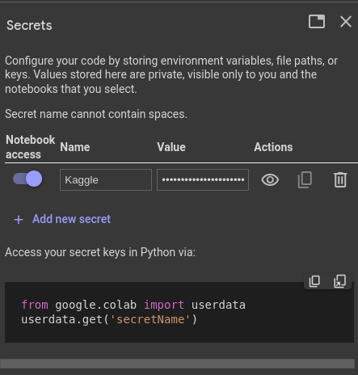

Using Kaggle API in Google Colab using Colab secrets
====================================================

Introduction
------------

Kaggle is one of the biggest platforms for
data science and machine learning enthusiasts.
It contains a huge number of datasets and a variety
of competitions. Sometimes you need to access those
datasets in your
`Google Colab <https://colab.research.google.com>`_.

In this tutorial, I'm about to show you one of the
ways that you can use **Kaggle CLI** to get a dataset
from
`Kaggle <https://www.kaggle.com/>`_
to your
`Google Colab <https://colab.research.google.com>`_,
using **Colab secrets**.

Kaggle account
--------------

If you don't have an account in
`Kaggle <https://www.kaggle.com/>`_,
you can simply make an account, by clicking on the
**register** button on the top right of the site.

If you already have an account you can log in to your
account using **Sign in** at the top right of the site.

Kaggle API token
----------------

After you sign in successfully,
you can get your **Kaggle API token**
by following these steps:

* Go to the `settings <https://www.kaggle.com/settings>`_
  of your account
* Go to the **API** section
* Press the **Create New Token** button

Doing the steps above will automatically start
downloading a file called **kaggle.json**. We need
this file in the next steps. the content of this file
looks like this:

.. code-block:: json

    {"username":"your_user_name","key":"your_key"}

Create a new secret in Google Colab
-----------------------------------

So, now we are going to create a secret in
`Google Colab <https://colab.research.google.com>`_.
To do so, we should follow these steps:

* Open or create a new notebook
* Click on the **key** logo on the left sidebar
* Press **Add new secret**
* Name the secret whatever you want, I name it
  **Kaggle**
* Copy all the content of **kaggle.json** that you
  already got it from the previous step to the
  **value** column.
* Slide the **Notebook access** to give this notebook
  access to this secret

After doing all the above steps, you should have
something like this:

Prepare the required file for using Kaggle CLI
----------------------------------------------

To be able to use **Kaggle CLI**,
we have to have a file in ``/root/.kaggle/kaggle.json``
with the content of our **secret** that we already made.

At first, we should get the **value** of our **secret**,
using the code below:

.. code-block:: python

    from google.colab import userdata
    kaggle_api = userdata.get('Kaggle')

The code above gets the **value** of the **secret**
and puts it in a variable called ``kaggle_api``.

Then we use the code below to make the file in the
path that is required and put the **value** in it.

.. code-block:: python

    from pathlib import Path

    target_path = Path('/root/.kaggle/kaggle.json')

    target_path.parent.mkdir(parents=True, exist_ok=True)

    with target_path.open('w') as target_file:
      target_file.write(kaggle_api)

After doing that, we can optionally change the
permission of that file to *600*.

.. code-block:: shell

    ! chmod 600 /root/.kaggle/kaggle.json

Now we are ready to use **Kaggle CLI**.

Download a dataset
------------------

To download a dataset from
`Kaggle <https://www.kaggle.com/>`_,
we can simply follow these steps:

* Go to the dataset that you want to download
* Press the three dots on the top right of the page
* Click on **Copy API command**
* Create a new cell in
  `Google Colab <https://colab.research.google.com>`_.
* Put an **!**, then paste the command after that
* Run the cell

After doing these steps, you can see the zip file of
the dataset, in the **files**.

Conclusion
----------

In this tutorial, I showed you how to
use **Colab secrets** to get a **dataset**
from
`Kaggle <https://www.kaggle.com/>`_.
But there is more you can do with
`Kaggle API <https://github.com/Kaggle/kaggle-api>`_
that you can find out more about in their
`Official GitHub project <https://github.com/Kaggle/kaggle-api>`_.

